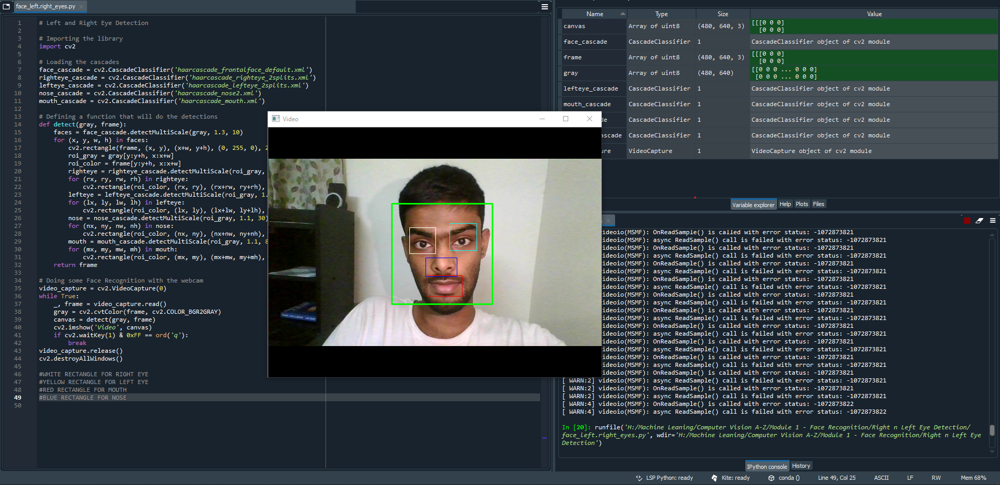

## micro project 1: basic_face_detection_2

### Aim: 
To detect the face and facial features 

### Major steps involved:
1.) Importing the required Libraries
2.) Loading the pre-trained Classifier for each feature 
3.) Defining a function which does the detections of facial features
4.) Face detection through webcam
5.) Calling the funtion for detection
6.) Previewing the live face detected video

### Classifiers:
I've used pretrained Classifiers, i.e haarcascade_frontalface_default (for detecting the face), haarcascade_righteye_2splits (for detecting the right eye), haarcascade_lefteye_2splits (for detecting the left eye), haarcascade_nose2 (for detecting the nose) and haarcascade_mouth (for detcting the mouth)

### Final Result:

